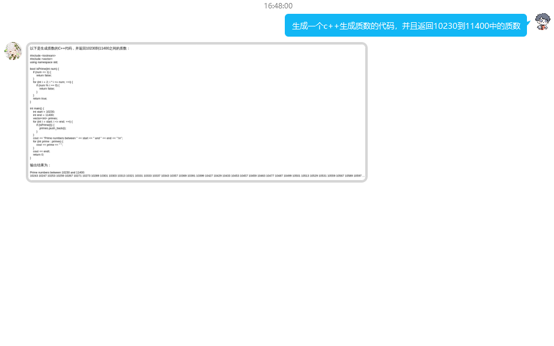
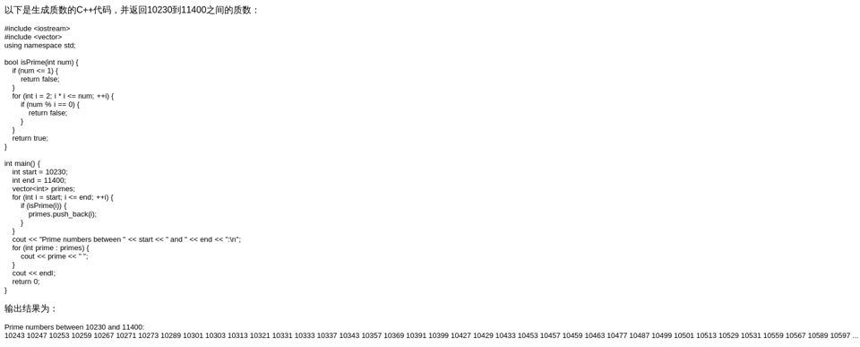
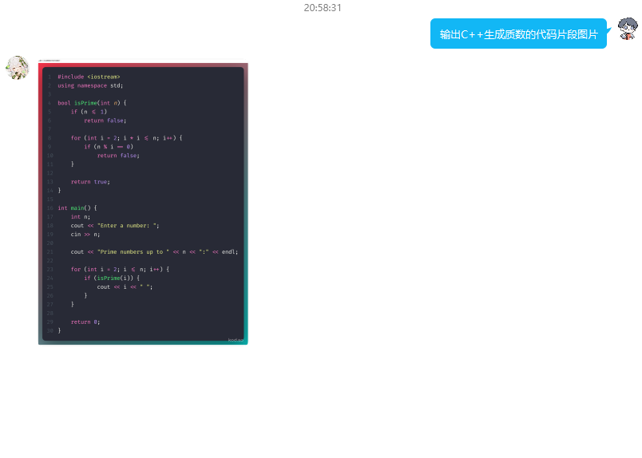

# QChatCodeRunner
- 适用于[QChatGPT](https://github.com/RockChinQ/QChatGPT)的代码运行插件,用ChatGPT来运行代码
- 基于 [code_runner](https://code-runner-plugin.vercel.app/)
- 与GPT4所使用的代码执行器**插件**相同
- 对于较大的需求，可能生成时间可能较长，请适当调高消息处理的超时时间

## 1、部署CodeRunner

- 下载本插件`!plugin get https://github.com/oliverkirk-sudo/QChatCodeRunner.git`
- fork [CodeRunner-Plugin](https://github.com/oliverkirk-sudo/CodeRunner-Plugin/fork)的代码
- 修改`config-template.py`配置文件名为`config.py`并按要求修改配置项并提交
- 在[vercel](https://vercel.com/)中部署CodeRunner-Plugin
- 添加环境变量 `MONGODB_URI` 形如 `mongodb+srv://`开头的链接，在[mongodb](https://www.mongodb.com/zh-cn)官网中可复制
- 添加环境变量 `ACCESS_KEY` 是域名缩短接口的访问密钥
- 如有必要，重新部署一次CodeRunner
- 当然也可以运行到自己服务器上，不过需要有外网环境。

## 2、部署链接缩短服务

- 因为网上免费的域名缩短服务收费、限制次数和会截断过长的域名，所以可以自己搭建一个
- 可以使用测试服务器 `http://7dk1cvezn.mghost.site/api.php` <br>
密钥 `aB3$gH8*jK6#mN1@pQ4&rT7%wZ0^cF5(iJ9)lO2!uV6*yB0#dG3&hJ8(kM1@oP4&rS7%vY0^zC5` 不保证稳定性与速度
- 首先要有一台服务器或是虚拟主机，我使用的是[幻梦云](https://www.menghuany.cn/aff/ZJTWFQKU),可以使用每个月1元的美国主机
<br>就足够了，缺点是速度慢，优点是便宜且分配域名
- 也可以使用[星辰云](https://starxn.com/aff/XUVRIOBP)，缺点是需要自己的域名，优点是速度快,每个月1.99元
- 下载[api](https://pewadw.lanzouy.com/iB35f16ahyti)服务,并编辑数据库地址，和位于第33行的验证密钥
- 上传  `api.php`与 `index.html`到虚拟主机
- 编辑Apache伪静态服务
```text
RewriteEngine On
RewriteCond %{REQUEST_FILENAME} !-f
RewriteCond %{REQUEST_FILENAME} !-d
RewriteRule ^(.*)$ api.php?short_link=$1 [QSA,L]
```
- 将api填入CodeRunner-Plugin的config中 `http://example.com/api.php`

## 3、安装wkhtmltopdf服务

- 在[wkhtmltopdf下载页](https://wkhtmltopdf.org/downloads.html)下载适用于自己相同的服务
- linux上使用 `which wkhtmltoimage` 查看安装位置
- 确保系统安装了微软雅黑字体

## 4、编辑插件配置项

```python
class Config:
    def __init__(self):
        self.domain = "" # CodeRunner-Plugin服务器域名
        self.pic_width = 480 # 生成图片的最大宽度，大于这个宽度会缩放
        self.pic_height = None # 生成图片的最大高度，会截断
        self.toMarkdownImg = False  # 是否开启结果转markdown
        self.proxy = None # 代理服务，不会代理markdown渲染服务
        self.wkhtmltoimage_path = "" # wkhtmltoimage文件的位置
```
CodeRunner-Plugin服务器域名有官方的`https://code-runner-plugin.vercel.app/` 缺点是被墙,且无法使用代码片段功能

## 5、我的其他插件
- [oliverkirk-sudo/chat_voice](https://github.com/oliverkirk-sudo/chat_voice) - 文字转语音输出，支持HuggingFace上的[VITS模型](https://huggingface.co/spaces/Plachta/VITS-Umamusume-voice-synthesizer),azure语音合成,vits本地语音合成,sovits语音合成
- [oliverkirk-sudo/qchat_system_status](https://github.com/oliverkirk-sudo/qchat_system_status) - 以图片的形式输出系统状态
- [oliverkirk-sudo/QChatAIPaint](https://github.com/oliverkirk-sudo/QChatAIPaint) - 基于[Holara](https://holara.ai/)的ai绘图插件
- [oliverkirk-sudo/QChatWeather](https://github.com/oliverkirk-sudo/QChatWeather) - 生成好看的天气图片，基于和风天气
- [oliverkirk-sudo/QChatMarkdown](https://github.com/oliverkirk-sudo/QChatMarkdown) - 将机器人输出的markdown转换为图片，基于[playwright](https://playwright.dev/python/docs/intro)

## 未完成的功能

- 测试一下代码片段功能如果有影响请注释掉

## 功能演示

演示使用的是接口是gpt3.5-tubor-16k，可能不够准确

<details>
<summary>表格生成</summary>


</details>

<details>
<summary>代码运行</summary>




</details>

<details>
<summary>代码保存</summary>


[演示的代码](http://2u2.cc/okDCaR9)

</details>

<details>
<summary>代码片段</summary>



</details>
